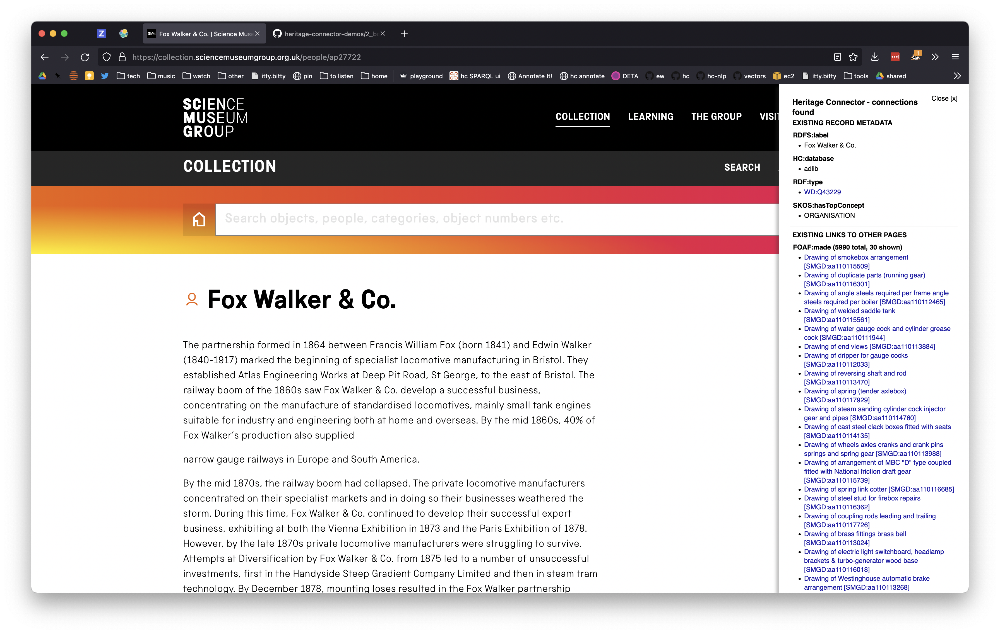

# Bookmarklet - Show me the connections!

A bookmarklet to show connections from one page its direct connections in the graph. Meant to be a quick way to prototype future collection website widgets.

We give thanks to [Roderic Page](https://github.com/rdmpage) for his work for the [TANC Heritage PIDs](https://tanc-ahrc.github.io/HeritagePIDs/) project, which inspired the idea and the code for this.



## Installation:

If you've never used a bookmarklet before, it might be worth running through [these instructions for different browsers](https://mreidsma.github.io/bookmarklets/installing.html).

1. Copy the below text. This is the code which runs the bookmarklet.
```
javascript:(function(a){%20a=document.createElement('script');a.type='text/javascript';a.src='//cdn.jsdelivr.net/gh/TheScienceMuseum/heritage-connector-demos@4f6cf97/2_bookmarklet/script.js';document.getElementsByTagName('body')[0].appendChild(a);})();
```
2. Add a new bookmark to your browser and call it whatever you want. Paste the text you copied into the 'URL' field.

## Usage:

Go to one of the pages in Heritage Connector and click the bookmarklet. A sidebar will pop up showing all the connections Heritage Connector has made from the current page to other SMG and Wikidata pages (as in the screenshot).

The bookmarklet works on any SMG pages that are in Heritage Connector. These include pages from:
- the SMG collection site: https://collection.sciencemuseumgroup.org.uk
- the SMG blog: https://blog.sciencemuseum.org.uk/
- the SMG journal: http://journal.sciencemuseum.ac.uk/

If a page doesn't work, it's likely it was recently added and isn't in the Heritage Connector database yet. If you *know* it's not, please get in contact with [Kalyan Dutia](https://kalyan.link).